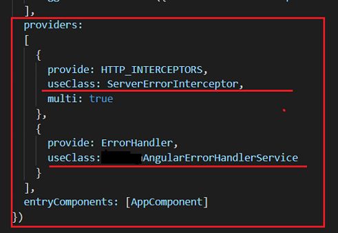

# Designing applications with Angular and NodeJs/TypeScript 

## Project's description

This article details implementing a demo website using Angular and NodeJS.

## Online article
Details about this project can be read in my blog's article here: 

[Article](https://www.ideliversoft.com/post/nodejs-and-angular-applications)

## Context
I have done this work in 2022. The main technologies used were: **Angular 7**, **NodeJS**, **SQL Server**, **MSAL** and **Azure SSO**.

